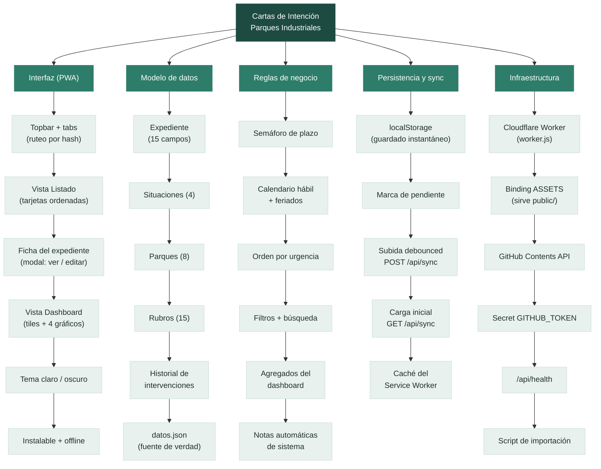
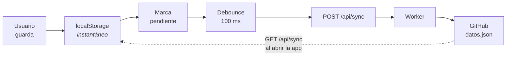

# EGPAIS — Cartas de Intención (Parques Industriales)

Seguimiento de cartas de intención presentadas para radicarse en los parques
industriales de Salta. PWA estática (un solo `index.html`) + Cloudflare Worker,
con **GitHub como base de datos**: todo vive en `datos.json`, versionado en este
repo y escrito únicamente por el Worker.

Hoy en producción: **157 expedientes**, 8 parques, 4 situaciones.

> Manual de uso para quien carga los datos: **[MANUAL.md](MANUAL.md)**.

---

## Mapa de la app



### 1. Interfaz (PWA) — `public/index.html`

Un único archivo: HTML, CSS y JS inline, sin build, sin dependencias, sin
framework. Dos vistas con tabs arriba y ruteo por `#hash` (`#dashboard` es
linkeable y sobrevive el refresh).

| Pieza | Qué hace |
|---|---|
| **Listado** | Tarjetas con nro. de expediente + empresa al frente; parque, rubro, semáforo y situación como contexto. Ordenadas por urgencia, no por fecha. |
| **Ficha** | Modal en dos modos: lectura (datos agrupados en Expediente / Contacto / Historial) y edición (formulario). Se abre en lectura, nunca en edición, para no tocar nada sin querer. |
| **Dashboard** | 5 stat tiles + 4 gráficos, todos calculados en vivo sobre el estado en memoria. |
| **Tema** | Claro por defecto, toggle a oscuro, preferencia en `localStorage`. Se aplica antes del primer pintado para que no haya flash blanco. |
| **PWA** | Service Worker (`public/sw.js`) con estrategia *stale-while-revalidate*; instalable en el celular. |

### 2. Modelo de datos

Un expediente es un objeto plano con 15 campos:

```json
{
  "id": "exp_imp001",
  "nro_expediente": "111975/2010-1009",
  "fecha_inicio": "01/09/2026",
  "anio_inicio_expediente": "2026",
  "nombre_empresa": "INDUSTRIAS FUNES",
  "parque_industrial": "Salta",
  "rubro": "Manufactura",
  "superficie_solicitada_m2": 15000,
  "actividad_empresa": "Ampliación de corte plegado y pintura industrial",
  "situacion": "En_tratamiento",
  "representante_nombre": "Victor Funes",
  "contacto_tel": "3875411112",
  "contacto_mail": "",
  "fecha_ultimo_movimiento": "01/09/2026",
  "intervenciones": []
}
```

- **Fechas**: siempre `dd/mm/aaaa` como string, parseadas en hora local (nunca
  `new Date("...")` sobre ISO, que corre un día por UTC).
- **Situaciones**: `Sin_tratamiento`, `En_tratamiento`, `Adjudicada`,
  `Desestimada`. Las dos últimas son terminales: no corren plazo.
- **Parques** (8): Salta, Güemes, RDLF, Mosconi, Pichanal, SAC, Olacapato,
  Salar de Pocitos. Cada uno con color fijo (`--s1`…`--s8`), validados para
  daltonismo.
- **Rubros** (15): Manufactura, Servicios, Acopio, Logística, Química,
  Alimenticia, Metalmecánica, Metalúrgica, Comercio, Construcción, Textil,
  Materiales de construcción, Maderera, Plástica, Otro.
- **`intervenciones`**: historial append-only. Cada nota es
  `{hora, texto, tipo}` con `tipo` `"manual"` (la escribió una persona) o
  `"sistema"` (la generó la app, p. ej. un cambio de situación).

El archivo completo es `{ "expedientes": [...], "plazoDias": 90 }`.

### 3. Reglas de negocio

**Semáforo de plazo.** Lo único no trivial de la app. Desde `fecha_inicio` se
cuentan `plazoDias` **días hábiles** (excluye sábados, domingos y la tabla de
feriados nacionales + 17/6 por Güemes, que es feriado en Salta). Contra esa
fecha de vencimiento:

| Color | Condición |
|---|---|
| 🔴 Rojo (sólido) | Vencido o vence hoy |
| 🟠 Naranja | Quedan ≤ 15 días hábiles |
| 🟡 Amarillo | Quedan ≤ 30 días hábiles |
| 🟢 Verde | Quedan más de 30 |
| — Sin semáforo | Situación terminal, o el expediente no tiene `fecha_inicio` (hoy, 24 de 157) |

El listado **ordena por ese color**: lo que vence primero aparece primero. Es
la decisión de diseño central — la app responde "qué tengo que mirar hoy", no
"qué cargué último".

`plazoDias` se edita desde el listado y se sincroniza igual que los
expedientes: es un parámetro de la organización, no una preferencia del
dispositivo.

**Agregados del dashboard.** Se recalculan en cada render desde el estado en
memoria; no hay valores precomputados ni caché que pueda quedar desfasada.

**Notas automáticas.** Al guardar, si cambió la situación, la app agrega sola
una nota de sistema (`En tratamiento → Adjudicada`) y actualiza
`fecha_ultimo_movimiento`. El historial nunca se edita ni se borra.

### 4. Persistencia y sync



Dos reglas que gobiernan todo el diseño:

1. **El guardado local es siempre instantáneo y nunca falla.** La subida va en
   background, debounced, y jamás bloquea al usuario. Sin internet se sigue
   trabajando igual; el indicador pasa a "⚠️ Sin conexión" y reintenta.
2. **Nunca se pisa trabajo no sincronizado.** Si al abrir hay cambios locales
   pendientes, la app los **sube** en vez de bajar; recién sin pendientes hace
   el `GET`.

El Service Worker cachea todo salvo `/api/*` — la sincronización nunca se
sirve de caché.

### 5. Infraestructura

```
navegador  ──►  Cloudflare Worker (worker.js)
                ├── /api/health   → diagnóstico (¿hay token? ¿hay assets?)
                ├── /api/sync GET  → lee datos.json de GitHub
                ├── /api/sync POST → escribe datos.json en GitHub (commit)
                └── /*            → env.ASSETS → public/ (la PWA)
```

El token de GitHub vive como secret del Worker. **El navegador nunca lo ve**:
esa es la razón de ser del Worker. Escribe vía GitHub Contents API, lo que deja
cada guardado como un commit — historial completo y gratis.

---

## Forma de los datos (`datos.json`)

```json
{
  "expedientes": [ { "id": "...", "nro_expediente": "...", "...": "..." } ],
  "plazoDias": 90
}
```

`datos.json` está versionado en `main` con los 157 expedientes de la planilla
de proyectos. La app no trae datos de ejemplo: si el navegador no tiene nada
guardado, la lista arranca vacía y se llena con lo que devuelve `/api/sync`.

---

## Deploy

1. `npm install -g wrangler` (si no lo tenés).
2. Generá un **Personal Access Token** de GitHub (classic, con permiso `repo`
   sobre `joaqu-coder/Parques-Industriales`, o un fine-grained token
   restringido a ese único repo con permiso de Contents: Read & write).
3. En el dashboard de Cloudflare → tu Worker → **Settings → Runtime
   variables and secrets** (NO en "Builds"): agregá `GITHUB_TOKEN` con ese
   token.
4. Push de este repo a GitHub y conectalo en Cloudflare Workers Builds, con
   **Build command: None** y deploy command `npx wrangler deploy`.
   (O `npx wrangler deploy` manual desde acá.)
5. Verificá `https://tu-worker.workers.dev/api/health` → debe devolver
   `tiene_github_token: true`. Si da `false`, revisá el paso 3: es el error
   más común (cargarlo en la sección que no corresponde).

## Las 5 trampas (ya pisadas una vez, no repetir)

1. El secret va en **Runtime variables and secrets**, nunca en Builds.
2. No agregues `[env.production]` al `wrangler.toml` si el deploy configurado
   en el dashboard es `npx wrangler deploy` sin `--env` — mover `[assets]`
   ahí rompe el binding y la PWA deja de servirse.
3. Un secret nuevo solo se aplica a deployments creados DESPUÉS de guardarlo
   — hace falta un push nuevo, no es caché del navegador.
4. El Service Worker (`public/sw.js`) ya excluye `/api/*` — si lo tocás, no
   saques ese `if`, o la sync "parece" rota sin estarlo.
5. UTF-8 en base64 ya está resuelto en `worker.js` con
   `decodeURIComponent(escape(atob(...)))` / `btoa(unescape(encodeURIComponent(...)))`
   — no "simplificar" sacando el escape/unescape, rompe tildes y ñ.

Y una sexta, del lado de la PWA: al cambiar `public/index.html` hay que subir
la versión del cache en `public/sw.js` (`CACHE = "...-v2"` → `v3`), o la
primera carga posterior al deploy sirve la copia vieja.

## Importar la planilla (`scripts/importar-planilla.py`)

```
python3 scripts/importar-planilla.py Proyectos_10102026.json datos.json
```

Decisiones de la conversión, por si hay que repetirla:

- `fecha_inicio` ← "Fecha de presetnación" (la planilla la trae en **M/D/YY**:
  `9/1/26` es el 1 de septiembre de 2026). Es la fecha con la que corre el
  semáforo de plazo. 24 expedientes no la tienen: quedan sin semáforo.
- `anio_inicio_expediente` ← "Fecha de inicio expe." (solo el año). Se guarda
  aparte, todavía sin uso en la app. En 18 filas ese año no coincide con el de
  la presentación: es así en la planilla, no se tocó.
- Situación: `ACTIVO` → **En tratamiento**, `DESESTIMADO` → **Desestimada**
  (situación nueva, no corre plazo, igual que Adjudicada).
- Rubro ← "Actividad", normalizando mayúsculas y typos (`Contrucción` →
  Construcción, `Alimenticias` → Alimenticia, `servicios`/`Servicio` →
  Servicios). Rubros nuevos: Manufactura, Servicios, Acopio, Metalúrgica,
  Comercio, Construcción.
- Parques nuevos: **Olacapato** y **Salar de Pocitos** (colores `--s7`/`--s8`,
  validados para daltonismo junto con los otros seis).
- Superficie: se guarda el número; cuando la planilla trae un rango
  (`1500/2500`) se guarda el primer valor y el texto original va al historial.
- "Observación" de la planilla → una nota en el historial del expediente.
- `Sin dato` / `Sin datos` / `Sin contacto` / `Sin mail` → campo vacío.

## Estructura del repo

```
.
├── public/
│   ├── index.html   ← toda la app (UI + lógica + sync), sin build
│   └── sw.js        ← Service Worker: caché y offline
├── worker.js        ← Cloudflare Worker: /api/health, /api/sync, assets
├── wrangler.toml    ← config del Worker y binding ASSETS
├── datos.json       ← la base de datos (157 expedientes)
├── scripts/
│   └── importar-planilla.py
├── README.md        ← esto
└── MANUAL.md        ← manual de uso
```

## Mantenimiento anual

La tabla `FERIADOS` en `public/index.html` llega hasta **2026**. Cada año, una
vez que el gobierno confirma por decreto los feriados trasladables, hay que
agregar el año siguiente. Si la tabla se queda corta, el semáforo cuenta como
hábiles días que no lo son y los vencimientos quedan unos días adelantados.

## Limitación aceptada por ahora

Última escritura gana — si dos dispositivos postean casi al mismo tiempo,
se pisan. Mientras sea una sola persona cargando datos (aunque sea desde
varios dispositivos, no simultáneamente), no es un problema real. Si en el
futuro carga más de una persona en simultáneo, la solución es comparar el
`sha` que devuelve el GET contra el actual antes de pisar.
