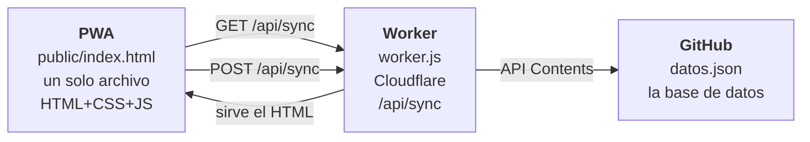
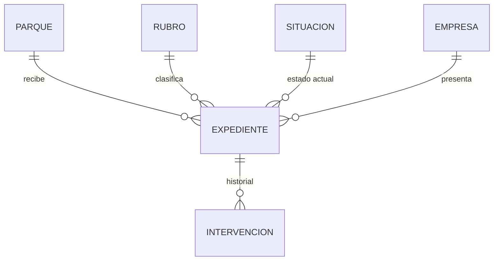
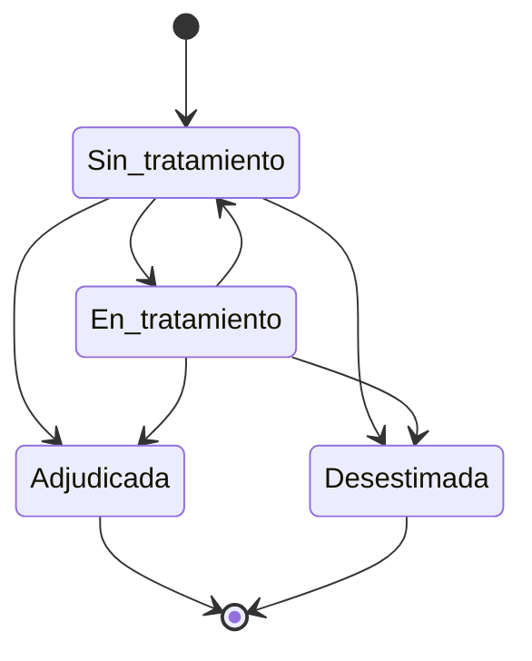
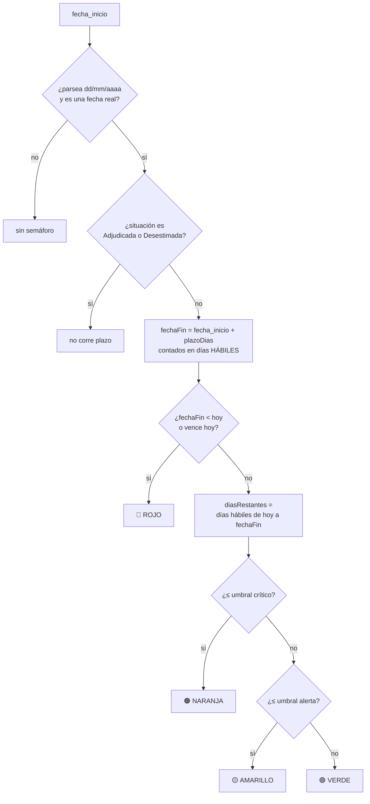
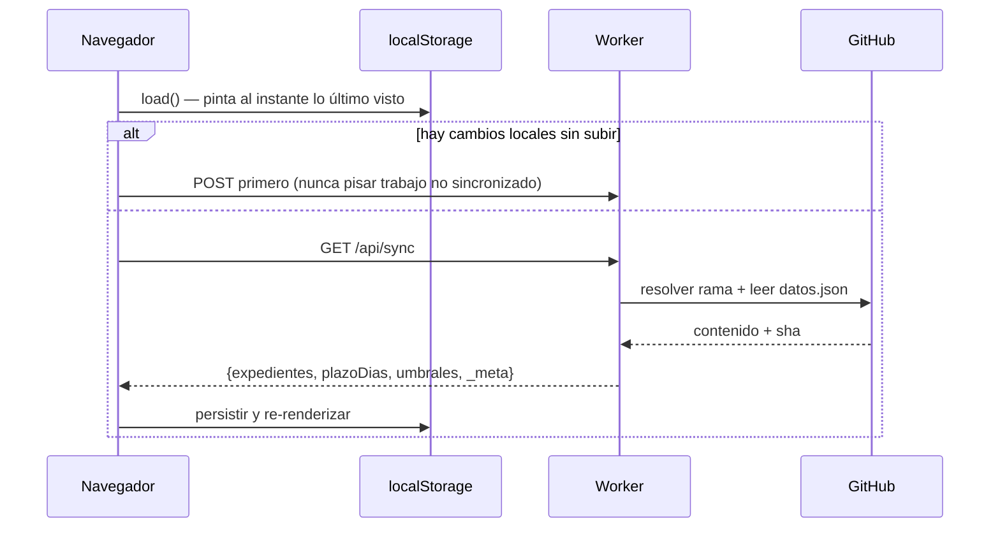
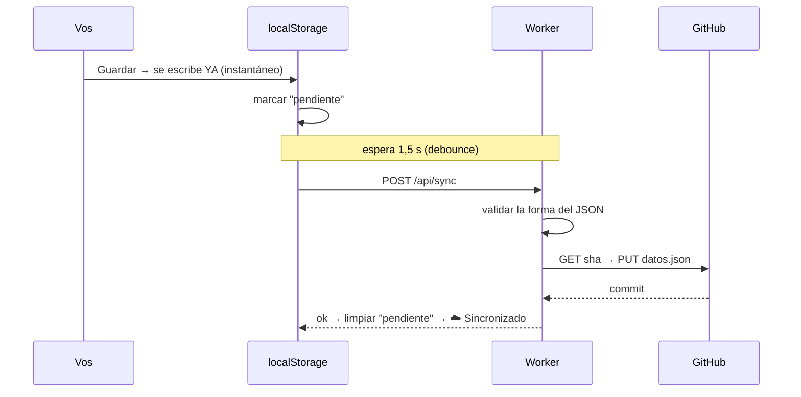

# Cómo opera la app

Documento de estructura: las piezas, el modelo de datos, las relaciones, el
motor de cálculo y los flujos. Si buscás cómo *usarla*, andá a
[MANUAL-DE-USO.md](MANUAL-DE-USO.md). Si buscás cómo *deployarla*, al
[README](../README.md).

---

## 1. Qué resuelve

Una oficina sigue **cartas de intención**: una empresa pide superficie en un
parque industrial, se abre un expediente, y alguien tiene que saber en qué
estado está cada uno y cuáles se están venciendo. Antes eso vivía en una
planilla. La app reemplaza la planilla por algo que: ordena por urgencia sola,
se puede cargar desde el celular, y guarda el historial de cada expediente.

Hoy hay **157 expedientes** cargados, importados de la planilla original.

---

## 2. Las tres piezas



| Pieza | Archivo | Rol |
|---|---|---|
| **PWA** | `public/index.html` | Toda la interfaz y toda la lógica de negocio. Sin framework, sin build, sin dependencias. |
| **Service Worker** | `public/sw.js` | Que la app abra sin conexión. Nunca cachea `/api/*`. |
| **Worker** | `worker.js` | Dos trabajos: servir los estáticos y ser el único que toca GitHub. |
| **Base de datos** | `datos.json` en el repo | Un archivo JSON versionado. Cada guardado es un commit. |
| **Importador** | `scripts/importar-planilla.py` | Conversión única de la planilla original. No corre en producción. |

**Por qué el Worker existe:** para que el token de GitHub nunca llegue al
navegador. El token vive como *secret* en Cloudflare. El navegador solo
conoce `/api/sync`.

**Por qué GitHub como base de datos:** no hay que administrar ni pagar nada,
y sale gratis el historial completo — cada cambio es un commit con fecha, y
cualquier estado anterior es recuperable.

---

## 3. El modelo de datos

`datos.json` tiene tres claves en la raíz:

```json
{
  "expedientes": [ /* el array de expedientes */ ],
  "plazoDias": 90,
  "umbrales": { "alerta": 30, "critico": 15 }
}
```

`plazoDias` y `umbrales` son **configuración global compartida**: viven en el
mismo archivo que los datos justamente para que, si los cambiás en la compu,
el celular los vea.

### El expediente

| Campo | Tipo | Obligatorio | Para qué sirve |
|---|---|---|---|
| `id` | texto | sí (lo genera la app) | Clave única. `exp_<base36>` nuevo, `exp_impNNN` importado. |
| `nro_expediente` | texto | no | El número administrativo real. Se muestra arriba en la tarjeta. |
| `nombre_empresa` | texto | **sí** | Identifica a la empresa. Es la clave de agrupación del dashboard. |
| `fecha_inicio` | `dd/mm/aaaa` | **sí** | Fecha de presentación. **Es la entrada de la que depende todo el semáforo.** |
| `anio_inicio_expediente` | texto `aaaa` | no | Año de apertura del expediente según la planilla. **Hoy la app no lo usa.** |
| `parque_industrial` | lista cerrada | no | Uno de los 8 parques. |
| `rubro` | lista cerrada | no | Uno de los 15 rubros. |
| `superficie_solicitada_m2` | número o `""` | no | m² pedidos. **Vacío no es cero** (ver §7). |
| `actividad_empresa` | texto libre | no | Qué hace la empresa, en prosa. |
| `situacion` | enum | sí (default `Sin_tratamiento`) | El estado del trámite. Ver §5. |
| `representante_nombre` | texto | no | Quién firma por la empresa. |
| `contacto_tel` | texto | no | Teléfono. |
| `contacto_mail` | texto | no | Mail. |
| `fecha_ultimo_movimiento` | `dd/mm/aaaa hh:mm` | no | Se actualiza sola cuando hay nota, cambio de estado o alta. |
| `intervenciones` | array | sí (puede ir vacío) | El historial. Ver abajo. |

### La intervención (una entrada del historial)

```json
{ "hora": "09/10/2026 14:32", "texto": "Llamó el representante.", "tipo": "manual" }
```

`tipo` es `manual` (la escribió una persona) o `sistema` (la generó la app,
hoy solo para cambios de situación). **Nunca se borran ni se editan**: el
historial es append-only. Se muestra del más nuevo al más viejo.

### Las listas cerradas

- **Parques (8):** Salta · Güemes · RDLF · Mosconi · Pichanal · SAC ·
  Olacapato · Salar de Pocitos. Cada uno tiene un color fijo (`--s1`…`--s8`),
  validado para daltonismo en claro y oscuro.
- **Rubros (15):** Manufactura · Servicios · Acopio · Logística · Química ·
  Alimenticia · Metalmecánica · Metalúrgica · Comercio · Construcción ·
  Textil · Materiales de construcción · Maderera · Plástica · Otro.
- **Situaciones (4):** ver §5.

Son listas cerradas en el formulario, pero el código **tolera valores fuera de
la lista** si llegan por sync o de una versión vieja: los agrupa como
`(sin parque)` / `(sin rubro)`, les da un color neutro y los declara en un
aviso, en vez de perderlos en silencio.

---

## 4. Las relaciones



El punto importante: **la empresa no es una entidad guardada.** No hay tabla
de empresas ni id de empresa. Se derivan en memoria agrupando por
`nombre_empresa` normalizado — minúsculas, espacios colapsados, punto final
removido (`claveEmpresa()`).

Consecuencias prácticas:

- 157 cartas dan **151 empresas distintas**, porque 6 empresas presentaron más
  de una. El dashboard explica esa diferencia en un aviso para que no parezca
  un error de conteo.
- Si el mismo nombre está escrito distinto (`S.A.` vs `SA`), son dos empresas
  para la app. Es la fragilidad conocida del modelo.
- Una empresa con dos cartas en rubros distintos **se cuenta en los dos**. Por
  eso la suma de "empresas por rubro" no da 151. También está declarado en la
  pantalla.

---

## 5. Estados y transiciones



| Situación | Corre plazo | Color de la etiqueta |
|---|---|---|
| **Sin tratamiento** | sí | gris |
| **En tratamiento** | sí | ámbar |
| **Adjudicada** | **no** — ya se resolvió | verde |
| **Desestimada** | **no** — ya se resolvió | rojo |

El diagrama es descriptivo, no prescriptivo: **la app no bloquea ninguna
transición**. Podés mover un expediente de Adjudicada a Sin tratamiento si te
equivocaste. Lo único que pasa automáticamente es que cada cambio de situación
deja una nota de sistema en el historial.

Hoy, de los 157: 107 Sin tratamiento · 17 En tratamiento · 32 Adjudicada ·
1 Desestimada. **124 corren plazo.**

---

## 6. El motor del semáforo

Es el único cálculo no trivial de la app.



**Día hábil** = no es sábado, no es domingo, y no está en la tabla de
feriados.

**Los parámetros son configurables y compartidos**, no están hardcodeados:
`plazoDias` (default 90), `umbrales.alerta` (30) y `umbrales.critico` (15).
Se editan desde Dashboard → Urgencias y viajan en `datos.json`. Regla
interna: `alerta` nunca puede ser menor que `critico` — si lo intentás, se
corrige sola.

### El `~` de "estimado"

La tabla de feriados está cargada **a mano** y cubre **2025–2026**. No se
puede calcular: los feriados trasladables y los puentes turísticos los fija el
gobierno por decreto cada año.

El código **sabe que no sabe**. Si el cálculo pisa un año fuera de la tabla
—sea porque el vencimiento cae después de 2026 o porque el expediente arrancó
antes de 2025— el plazo se muestra con `~` y una explicación al tocarlo. Como
los feriados que faltan solo pueden *agregar* días, la fecha real es siempre
igual o posterior a la mostrada: la estimación es conservadora.

Hoy **72 de los 109 expedientes con semáforo** se muestran como estimados,
porque arrancaron antes de 2025. Para extender: agregá el año al array
`FERIADOS` y el aviso desaparece solo (`FERIADOS_HASTA_ANIO` se deriva de la
propia tabla).

> Rendimiento: `diasHabilesEntre()` es aritmética pura, no itera día por día.
> Con expedientes de 2013 el bucle costaba miles de vueltas por expediente en
> cada render.

---

## 7. Reglas de cálculo del dashboard

Cuatro reglas que explican por qué los números son los que son:

1. **Una sola fuente.** Todo se calcula una vez en `calcularMetricas()`. Las
   secciones solo leen de ahí. Si una necesita un número de otra —la tasa
   general como línea de referencia por parque— lo referencia, no lo
   recalcula. Así dos pantallas no pueden mostrar cifras distintas.
2. **Un campo vacío no es un cero.** Los 50 expedientes sin superficie quedan
   *fuera* de la suma, no entran como 0. El total es un piso, no un valor
   cerrado, y la pantalla lo dice.
3. **Cada número declara de dónde sale.** Debajo de cada gráfico hay una línea
   con el campo y el filtro usados.
4. **El dashboard ignora los filtros del listado.** Siempre mira los 157.

Además: los rankings muestran **top 5 + "Ver todos"**, y los parques con
**menos de 5 expedientes** se marcan como *muestra chica* y se ocultan por
defecto en la tasa de adjudicación — un parque con 1 carta y 1 adjudicación da
100% y no es comparable con uno de 50.

---

## 8. El flujo de datos

### Al abrir la app



La app **siempre pinta primero desde localStorage**, así abre instantánea y
funciona sin conexión. La red llega después y corrige.

`_meta.existe` distingue *"el repo tiene cero expedientes"* de *"datos.json
todavía no existe"*. Sin esa distinción, una lista vacía legítima no se podría
diferenciar de una falta de inicialización.

### Al guardar



**El guardado local es instantáneo y pase lo que pase.** La subida va en
segundo plano y nunca bloquea. Si falla, reintenta con *backoff exponencial*
(2s, 4s, 8s, 16s, 32s, después cada 60s). Un error 4xx se marca como
**permanente** y no se reintenta en loop: reintentar no lo va a arreglar, hay
que corregir la causa y tocar *Reintentar*. Cuando vuelve la red, reintenta
de inmediato sin esperar el backoff.

### Cuándo se baja de nuevo

- Al abrir la app.
- Al volver a la pestaña (`visibilitychange` / `focus`), con un piso de 30 s.
- **Nunca** si el modal está abierto (no se le mueve el piso a alguien que
  está escribiendo) ni si hay cambios locales sin subir.

No hay poll continuo: un cambio hecho en otro dispositivo mientras mirás la
pestaña en primer plano no aparece solo.

---

## 9. Dónde vive cada cosa

| Dato | Dónde | Se comparte entre dispositivos |
|---|---|---|
| Expedientes | `datos.json` + espejo en localStorage | **sí** |
| `plazoDias`, `umbrales` | `datos.json` + espejo en localStorage | **sí** |
| Bandera "hay cambios sin subir" | localStorage | no |
| Fecha de la última sync | localStorage | no |
| Tema claro/oscuro | localStorage | no |
| Filtros, búsqueda, sección del dashboard | memoria (se pierden al recargar) | no |
| Token de GitHub | secret de Cloudflare | nunca sale del Worker |

Claves de localStorage: `cartas_intencion_parques_v3`, `..._plazo_v1`,
`..._umbrales_v1`, `..._sync_pendiente_v2`, `..._ultima_sync_v1`,
`..._theme_v1`. El sufijo de versión se sube cuando hay que invalidar el
cache viejo de los navegadores.

---

## 10. Mapa del código

`public/index.html` es un solo archivo de ~1.970 líneas, en este orden:

| Bloque | Funciones principales |
|---|---|
| Constantes | `PARQUES`, `RUBROS`, `SITUACIONES`, `FERIADOS`, umbrales |
| Fechas | `parseFechaLocal` (estricta), `fechaISO`, `hoyLocal`, `horaLocal` |
| Semáforo | `calcularFechaFin`, `diasHabilesEntre`, `calcularPlazo`, `obtenerSemaforo`, `urgenciaDe` |
| Persistencia | `load`, `persistirLocal`, `save`, `loadPlazo`, `loadUmbrales` |
| Sync | `marcarPendiente`, `subirCambios`, `bajarCambiosIniciales`, `proximoBackoff`, `setSyncStatus` |
| Routing | `showView` + `hashchange` (`#listado` / `#dashboard`) |
| Listado | `expedientesFiltrados`, `renderList`, `expCardHtml` |
| Métricas | **`calcularMetricas`** — el corazón del dashboard |
| Secciones | `secResumen`, `secSituacion`, `secParques`, `secRubros`, `secUrgencias` |
| Gráficos | `mrow` (barras), `renderAnual` (SVG apilado), `drillPanel` |
| Ficha | `openModal`, `renderModalView`, `renderModalEdit`, `validarExpediente`, `onSave`, `onDelete` |

**Patrón de render:** no hay DOM incremental. Cada cambio de estado
re-renderiza el bloque entero con `innerHTML`, y los clicks se atienden con
**handlers delegados** en el contenedor. Por eso una tarjeta funciona igual en
el listado que dentro de un panel del dashboard: es la misma función
`expCardHtml()` y el mismo handler.

**Escape obligatorio:** todo lo que viene de los datos pasa por `esc()` antes
de entrar al HTML. Es la única defensa contra inyección en este patrón.

---

## 11. Invariantes — lo que no hay que romper

1. **El guardado local va primero, siempre.** Ninguna falla de red puede
   perder lo que la persona escribió.
2. **Nunca pisar trabajo no sincronizado.** Si hay cambios locales pendientes,
   el GET no corre: primero sube.
3. **El historial es append-only.**
4. **Vacío ≠ cero** en toda métrica.
5. **`/api/*` nunca se cachea** en el Service Worker.
6. **El token nunca llega al navegador.**
7. **Un 404 de GitHub no significa "está vacío".** Puede ser archivo, rama,
   repo o permisos. Colapsar los cuatro casos fue el bug más caro del
   proyecto (trampa 6 del README).
8. **El `~` no se saca** mientras la tabla de feriados no cubra el rango.

## 12. Pruebas

`npm test` corre 7 suites sin mockear código propio: cargan `index.html`,
`worker.js` y `sw.js` tal cual se despliegan y solo simulan lo externo (API de
GitHub, red, reloj, Cache API). Cada suite fue validada reintroduciendo el bug
que debe atrapar. Hoy: **todo verde**.

> Todavía no corren solas: no hay CI. Hay que acordarse de ejecutarlas.
